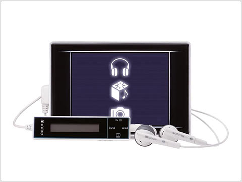

```{python}
#| message: false
#| warning: false
import pandas as pd
import matplotlib

df = pd.read_csv("sensor_database_detailed.csv")

```

Sensor data acquired from: https://github.com/openMVG/CameraSensorSizeDatabase
MIT License included in repo.

```{python}
df.head()
```
Here is my dataset on camera sensors. We will be using this to explore how different manufacturers make products in specific sectors.

```{python}
#| label: load-data
import pandas as pd
import matplotlib.pyplot as plt

df = df.rename(columns={
    "SensorWidth(mm)": "width_mm",
    "SensorHeight(mm)": "height_mm",
    "SensorWidth(pixels)": "width_px",
    "SensorHeight(pixels)": "height_px",
})
df["area_mm2"] = df["width_mm"] * df["height_mm"]
df["megapixels"] = round(df["width_px"] * df["height_px"] / 1_000_000, 2) #round the float to 2 decimal places.
df["pixel_pitch_um"] = df["width_mm"] / df["width_px"] * 1000 # calculate pixel pitch in micrometers.
df.head()
```
Let's calculate the sensor size and resolution using the data we are given. We'll use a logarithmic scale for the sensor area as the smallest sensors used are 50x smaller than the largest sensors!

We'll also calculate the pixel pitch. This is the width of a pixel and tells us how small each unit of light gathering "pixel" is. This will be interesting if a camera sensor does pixel binning or other such computational photography techniques.

```{python}
#| label: fig-sensor-area-vs-mp
#| fig-cap: "Sensor area against resolution. The seven makers with the most models are coloured; all others are grey."
top_makers = df["CameraMaker"].value_counts().nlargest(7).index
others = df[~df["CameraMaker"].isin(top_makers)]

fig, ax = plt.subplots(figsize=(8, 5))
ax.scatter(others["area_mm2"], others["megapixels"],
           color="lightgrey", s=12, label="Other")
for maker in top_makers:
    g = df[df["CameraMaker"] == maker]
    ax.scatter(g["area_mm2"], g["megapixels"], s=14, alpha=0.7, label=maker)

ax.set_xscale("log")
ax.set_xlabel("Sensor area (mm², log scale)")
ax.set_ylabel("Resolution (megapixels)")
ax.legend(title="Maker", fontsize="small")
plt.show()

```

While we can clearly see some trends it doesn't make much sense to us right now. So let's add some calculated sensor sizes for some more context.

```{python}
#| label: sensor-formats
formats = pd.DataFrame(
    [
        ('1/2.3"',        6.17,  4.55),
        ('1/1.7"',        7.60,  5.70),
        ('2/3"',          8.80,  6.60),
        ('1"',           13.20,  8.80),
        ("Micro 4/3",    17.30, 13.00),
        ("APS-C",        23.60, 15.60),
        ("Full frame",   36.00, 24.00),
        ("Medium (GFX)", 43.80, 32.90),
    ],
    columns=["format", "width_mm", "height_mm"],
)
formats["area_mm2"] = formats["width_mm"] * formats["height_mm"]
formats.round({"area_mm2": 1})
```

I found the sensor size data from wikipedia [here](https://en.wikipedia.org/wiki/Image_sensor_format)

```{python}
#| label: fig-sensor-area-vs-mp-sensor-type
#| fig-cap: "Sensor area against resolution. Dashed lines mark common sensor formats. The seven makers with the most models are coloured; all others are grey."
top_makers = df["CameraMaker"].value_counts().nlargest(7).index
others = df[~df["CameraMaker"].isin(top_makers)]

fig, ax = plt.subplots(figsize=(9, 5.5))

for _, fmt in formats.iterrows():
    ax.axvline(fmt["area_mm2"], color="black", linestyle="--",
               linewidth=0.8, alpha=0.4, zorder=0)
    ax.text(fmt["area_mm2"], 1.01, fmt["format"],
            transform=ax.get_xaxis_transform(),
            rotation=90, ha="center", va="bottom", fontsize=8)

ax.scatter(others["area_mm2"], others["megapixels"],
           color="lightgrey", s=12, label="Other")
for maker in top_makers:
    g = df[df["CameraMaker"] == maker]
    ax.scatter(g["area_mm2"], g["megapixels"], s=14, alpha=0.7, label=maker)

ax.set_xscale("log")
ax.set_xlabel("Sensor area (mm², log scale)")
ax.set_ylabel("Resolution (megapixels)")
ax.legend(title="Maker", fontsize="small")
plt.show()
```

We notice here that there are 3 cameras with very large sensors and 3 with very small sensors so let's have a look at these.

```{python}
#| label: outliers
cols = ["CameraMaker", "CameraModel", "SensorDescription",
        "width_mm", "height_mm", "area_mm2", "megapixels"]

tiny = df[df["area_mm2"] < 10].sort_values("megapixels")
tiny[cols]
```

Looks like it's a weird Olympus camera/music player combo along with 2 raspberry pi camera sensor modules. 

{width=200px}

```{python}
medium = df[df["area_mm2"] > 1000].sort_values("area_mm2")
medium[cols]
```

```{python}
medium["CameraMaker"].value_counts()
```

Leica and Pentax medium format cameras! Very expensive.

```{python}
#| label: fig-outlier-cameras
#| fig-cap: "Look at these weirdos!"

top_makers = df["CameraMaker"].value_counts().nlargest(7).index
others = df[~df["CameraMaker"].isin(top_makers)]

fig, ax = plt.subplots(figsize=(9, 5.5))

for _, fmt in formats.iterrows():
    ax.axvline(fmt["area_mm2"], color="black", linestyle="--",
               linewidth=0.8, alpha=0.4, zorder=0)
    ax.text(fmt["area_mm2"], 1.01, fmt["format"],
            transform=ax.get_xaxis_transform(),
            rotation=90, ha="center", va="bottom", fontsize=8)

ax.scatter(others["area_mm2"], others["megapixels"],
           color="lightgrey", s=12, label="Other")
for maker in top_makers:
    g = df[df["CameraMaker"] == maker]
    ax.scatter(g["area_mm2"], g["megapixels"], s=14, alpha=0.7, label=maker)

ax.set_xscale("log")
ax.set_xlabel("Sensor area (mm², log scale)")
ax.set_ylabel("Resolution (megapixels)")
ax.legend(title="Maker", fontsize="small")


outliers = pd.concat([tiny, medium])
for _, row in outliers.iterrows():
    right_side = row["area_mm2"] > 100
    ax.annotate(row["CameraModel"], (row["area_mm2"], row["megapixels"]),
                xytext=(-5 if right_side else 5, 0), textcoords="offset points",
                ha="right" if right_side else "left", va="center", fontsize=7)
plt.show()
```

We also see 2 weird dots with very high megapixel counts on comparatively small sensor sizes.

```{python}
#| label: small-high-mp
small_high_mp = df[(df["megapixels"] > 35) & (df["area_mm2"] < 200)]
small_high_mp[cols]
```

They turn out to be Nokia phones. These 41 mega pixel monsters were released in 2012 for the 808 and 2013 for the 1020.

They use a technique called pixel binning which takes an average of the information in adjacent pixels to make a "super pixel" that has higher low light performance.

Now that we have some weirdly dense sensors let's use the pixel pitch calculation that we did before.

```{python}
#| label: high-mp-comparison
high_mp = df[df["megapixels"] > 35].sort_values("area_mm2")
high_mp[["CameraMaker", "CameraModel", "area_mm2",
         "megapixels", "pixel_pitch_um"]].round(2)
```

We can see that even though the Leica S2 has a lower megapixel count than the Nokia 808, the pixel pitch ends up being over 5 times bigger. This results in better light gathering per pixel and higher image quality.
Add that to the much larger and higher quality lenses that the Leica uses and you get image quality that is incomparable to the Nokia.

The devil really is in the details!


>AI Disclosure: All analysis are my own but I used claude to give a general framework of and to pretty up graphs along with calculating the industry standard sensor sizes.