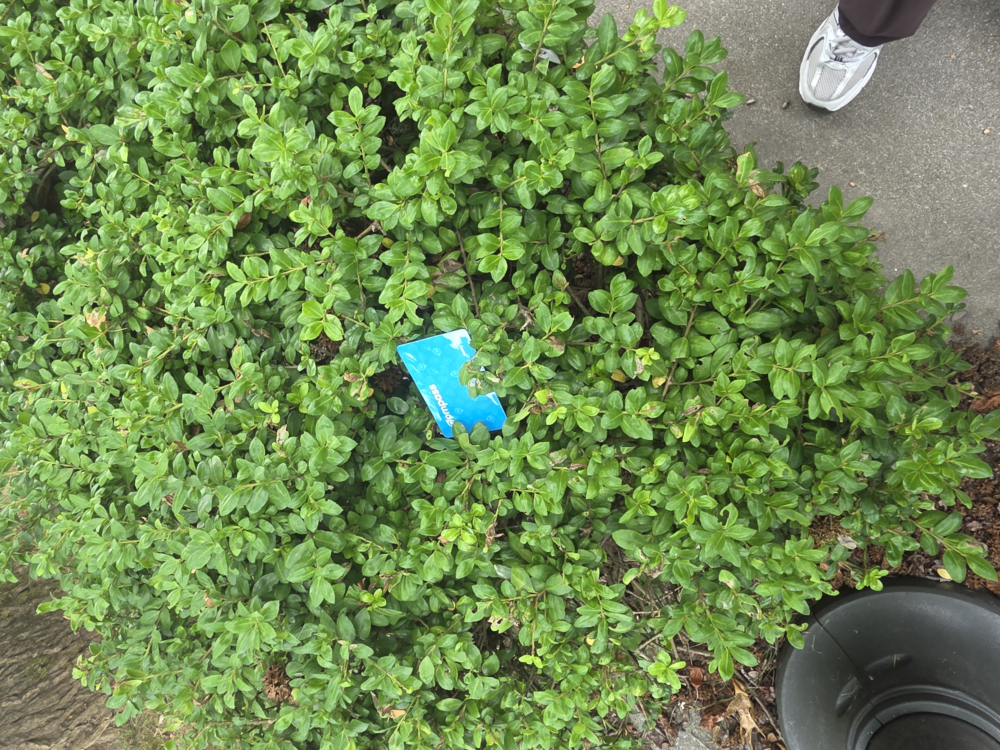

Orientation and the first week of classes were a whirlwind of action. Meeting new people and socializing with my cohort was both exhausting and rewarding. I met a ton of very interesting people and hope that I can continue to make more friends throughout the year.

While the coursework was relatively easy in the first week I'm a bit worried that I wont be able to keep up or will get buried in an avalanch of work. The one hour commute also doesn't help.

I hope that this page can serve as a record of the trials and tribulations I experience as this year starts.

